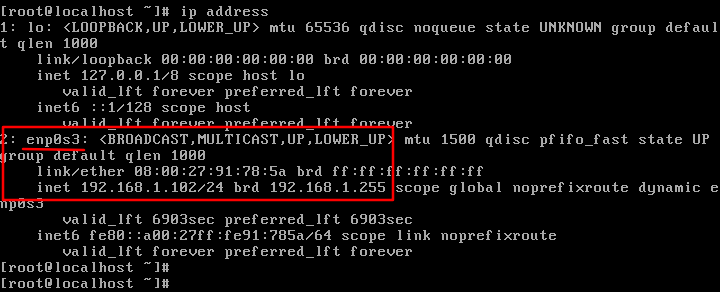
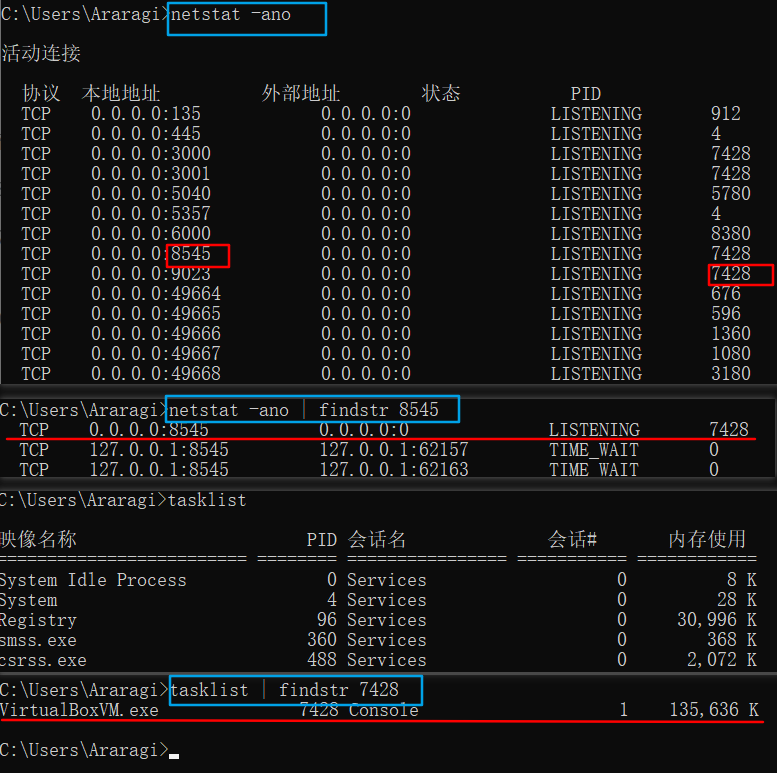
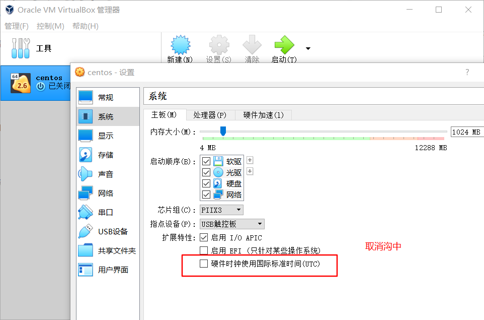
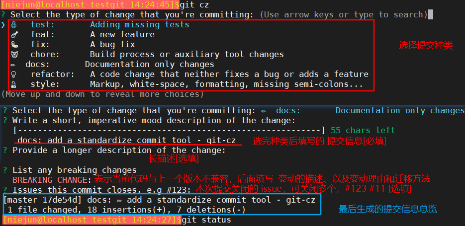

# 如何连接 VB里的centos

## wifi模式下推荐使用(NAT)

简单可行，只需配置virtualbox:

> 右键选择 ***VirtualBox6.1.4*** 里的Linux，我这里是以centos7为例子。 右键->设置->网络 连接方式选择 ：网络地址转换（NAT） 然后点高级->端口转发， 如图配置即可： 
>
> 
>
> 端口转发设置非常重要，shell连接本地ip上的9023端口，即可转发到虚拟机里的22端口。 主机端口和子系统端口可自己定义，根据实际需求设置。
>
> ***MobaXterm V20.1***  下ssh连接设置如下
>
> 
>
> 这样配置后，会通过ssh连接上本地虚拟机，并进入 配置的特定用户目录下

## 虚拟机的四种网络连接方式

|                   | NAT  | Bridged Adapter |   Internal   | Host-only Adapter |
| :---------------: | ---- | :-------------: | :----------: | :---------------: |
|   虚拟机 → 主机   | √    |        √        |      ×       | 默认不能，需设置  |
|   主机 → 虚拟机   | ×    |        √        |      ×       | 默认不能，需设置  |
| 虚拟机 → 其他主机 | √    |        √        |      ×       | 默认不能，需设置  |
| 其他主机 → 虚拟机 | ×    |        √        |      ×       | 默认不能，需设置  |
|    虚拟机之间     | ×    |        √        | 同网段名可以 |         √         |

PS：若宿主机连的是**wifi**，虚拟机要想访问外网，xshell连上虚拟机，虚拟机的网络连接必须设置为 "网络地址转换(NAT)"，此模式相当于宿主机的一个应用，**用的ip地址是宿主机的**。且NAT模式下所有的端口号要想宿主机、外网主机能访问到，必须在**端口转发中加上该端口**。

​		若宿主机插了网线，可以考虑使用桥接模式，此模式下**相当于与宿主机同网段的另一台主机**。

但此模式最好设置一个固定的ip地址否则每次dhcp自动分配，xshell连接和访问linux下的web应用都需要重新更改ip地址。

## 桥接模式下设置固定ip地址(网线)

> (连的wifi推荐使用 地址转换NAT，不需进行下列操作)
>
> 参考文章： [virtualBox装虚拟机能ping通baidu，但查不出ip，也不能连接xshell的解决办法](https://blog.csdn.net/qq_41063141/article/details/93885103)
>
> 1. 首先在宿主机上 查看当前连接网络的ipv4地址和默认网关（windows使用 ipconfig命令）
>
> 2. 查看虚拟机启用的网卡和ip地址(Centos使用的是 **ip addr** 而不是 ifconfig)
>
> 
>
> 可以看到此处启用的网卡名是  enp0s3
>
> 3. 修改上面对应网卡的配置文件，这里是 /etc/sysconfig/network-scripts/ifcfg-enp0s3，禁用 dhcp设置静态ip地址
>
> 
>
> ​		把BOOTRPOTO修改成了static，是因为dhcp是自动获取，如果不改成static，我们在这里修改的这些地址不会生效，因为重启网络服务时，BOOTRPOTO的值决定了是自动分配还是使用静态数据，DNS1和DNS2对应的是宿主机的首选DNS服务器和备用DNS服务器
>
> 4. 重启网络  **sudo service network restart**
>
> 5. 经过上面操作后就可以 通过上面设置的静态ip地址 访问虚拟机里的web应用，xshell连接等。

# windows如何查看端口是否被占用

> 进入命令窗口
>
> netstat -ano  # 列出所有端口情况，最后一列是占用该端口的进程id
>
> netstat -ano | findstr 8545  # 查看8545端口占用情况，无占用则输出空
>
> netstat -ano | findstr 7428  # 查看进程id为7428的进程信息，可以看到进程名
>
> 

# Linux命令

## linux时间及时区设置

```shell
##### 设置 date命令 显示的时区
date   # 查看当前时间  若显示 Mon Mar 23 14:01:05 EDT 2020 则代表时区是EDT美国东部时间(与北京时间的时差是 -12h)
sudo cp /usr/share/zoneinfo/Asia/Shanghai /etc/localtime   #将时区切换到中国 使用date将显示 类似 Tue Mar 24 02:04:49 CST 2020
# sudo cp /usr/share/zoneinfo/America/New_York /etc/localtime  # 切换回EDT时区

##### 永久修改系统时间
sudo hwclock --set --date "2020-4-1 18:14:30"    # 修改硬件时间(每次重启linux，系统时间会等于硬件时间，故直接修改硬件时间)
sudo hwclock --show  # 查看硬件时间
sudo hwclock --hctosys   # 同步系统时间和硬件时间，即 将当前系统时间置为 硬件时间

# 重启系统查看是否永久修改系统时间
reboot  # 重启系统
date    # 重启系统可以发现硬件时间和系统时间都修改成功

sudo hwclock -w    # 将硬件时间置为当前系统时间
```

> 注：virtualbox的虚拟机，默认每次开机会获得宿主机的本地时间，获得的时间会比宿主机***晚8个小时***，此时需要设置virtualbox，再***设置—系统里，取消勾中硬件时钟使用国际标准时间(UTC)***
>
> 
>
> 另：每次fn+f12(即电脑进入***休眠***时间)，虚拟机里的时间(包括系统时间和硬件时间)会***停止计时***，这也就导致，休眠之后再唤醒电脑虚拟机里的时间仍是上回休眠之前的。
>
> 目前没什么好办法，只好休眠之前关闭虚拟机，或时间差一点不管，差得多虚拟机关闭再开。
>
> ## 总结
>
> virtualbox里 设置—系统—取消勾中硬件时钟使用国际标准时间(UTC)
>
> sudo cp /usr/share/zoneinfo/Asia/Shanghai /etc/localtime   #将时区切换到中国 使用date将显示 类似 Tue Mar 24 02:04:49 CST 2020

## 修改Linux终端命令提示符

> 1.设置提示符格式——PS1
>
> PS1是Linux终端用户的一个环境变量，用来说明命令行提示符的设置。
>
> #### PS1定义中常用的参数含义
>
> \d ：#代表日期，格式为weekday month date，例如：”Mon Aug 1”
> \H ：#完整的主机名称
> \h ：#仅取主机的第一个名字
> \T ：#显示时间为24小时格式，如：HH：MM：SS
> \t ：#显示时间为12小时格式 , 如：HH：MM：SS
> \A ：#显示时间为12小时格式：HH：MM
> \u ：#当前用户的账号名称
> \v ：#BASH的版本信息
> \w ：#完整的工作目录名称
> \W ：#利用basename取得工作目录名称，所以只会列出最后一个目录
> #：#下达的第几个命令
> \$ ：#提示字符，如果是root时，提示符为：# ，普通用户则为：\$
>
> ~~~shell
> echo $PS1 # 查看当前linux环境变量PS1,未改的话是  PS1=[\u@\h \W]\$
> ~~~
>
> #### 设置颜色
>
> 在PS1中设置字符颜色的格式为： [\e[F;Bm]，其中“F“为字体颜色，编号为30-37，“B”为背景颜色，编号为40-47。颜色表如下：
>
> > [\e[F;Bm]*需要改变颜色的部分*[\e[0m]
> >  开始颜色输入：[\e[F;Bm]
> >  结束颜色输入：[\e[0m]
> >  　　　　F　Bm
> >  　　　　30 40 黑色
> >  　　　　31 41 红色
> >  　　　　32 42 绿色
> >  　　　　33 43 黄色
> >  　　　　34 44 蓝色
> >  　　　　35 45 紫红色
> >  　　　　36 46 青蓝色
> >  　　　　37 47 白色
> >  　　　　
> >  设置特殊显示　
> >  　　　　 0 OFF，关闭颜色
> >  　　　　 1 高亮显示
> >  　　　　 4 显示下划线
> >  　　　　 5 闪烁显示
> >  　　　　 7 反白显示
> >  　　　　 8 颜色不可见
> >  特殊显示可在结束颜色输入里面设置：[\e[ 特殊颜色编号 m]
> >  　　　　
> >  根据颜色表，套用入字符颜色设置格式中，就可以对linux终端命令行颜色进行个性化设置了。比如要设置命令行的格式为黄字红底闪烁，显示当前用户的账号名称、主机的第一个名字、完整的当前工作目录名称、24小时格式时间，就可以使用如下的命令：
> >  PS1="[\e[1;5;41;33m][\u@\h \W\t]\$[\e[0m]"
> >
> > 
>
> #### 保存设置（修改配置文件）
>
> 通过上面的设置只能改变当前终端的命令行格式，关闭这个终端，在重新打开的一个终端中命令行格式又会恢复到默认的形式。想要永久性的改变终端命令行格式，需要修改.bashrc文件。
>  写入`/etc/profile或/etc/bashrc`对全部用户生效；写入`~/.bash_profile或~/.bashrc`只对当前用户生效。
>
> ```shell
> vi ~/.bashrc # 修改PS1配置，再文件中加入  PS1="\[\e[1;5;41;33m\][\u@\h \W\t]\\$\[\e[0m\]"
> .~/.bashrc    # 重新加载配置文件(OR source ~/.bashrc OR 退出终端重新进入)
> ```
>
> 这样就可以永久性的改变终端命令行格式了。

## Linux新建普通用户并赋予sudo权限

### 查看当前系统所有用户

~~~shell
cat /etc/passwd  # 看第三个参数:500以上的,就是后面建的用户了.其它则为系统的用户.
cat /etc/group  # 看第三个参数:500以上的,就是后面建的用户组了.其它则为系统的用户组.
groups  # 查看当前用户所在的用户组还有哪些用户
~~~

### 新建用户

```shell
su root    # 切换到root用户，新建用户需root权限，若当前登录时root账号，则无需此操作
adduser niejun  # 增加新用户 niejun
passwd niejun # 修改默认密码（若输入的密码很简单会提示，忽略即可）
## 默认情况下创建一个用户账号a，会创建一个/home/a目录和一个用户邮箱/var/spool/mail/a
```

### 为新用户授予 sudo权限

1. 查找授权管理文件sudoers

   ~~~shell
   whereis sudoers  # 可以看大这个文件位于 /etc/sudoers
   ~~~

2. 修改sudoers的写权限

   ~~~shell
   chmod -v u+w /etc/sudoers   # 为当前用户添加写权限，该文件默认是只读的
   ~~~

3. 修改sudoers内容

   ~~~shell
   vi /etc/sudoers   
   
   #按insert进入编辑模式，找到 root用户在的位置添加如下内容   
   niejun 	ALL=(ALL)			ALL
   # 效果如下所示
   ## Allow root to run any commands anywhere
   root 	ALL=(ALL)			ALL
   niejun 	ALL=(ALL)			ALL
   ## 最后按 esc 进入命令模式 键入命令 ZZ  保存退出
   ~~~

4. 收回sudoers的写权限

	~~~shell
	chmod -v u-w /etc/sudoers    #收回当前用户对 /etc/sudoers 文件的写权限
	~~~

### 用户切换

```
su niejun  # 切换到用户 niejun
whoami     # 查看当前登录是哪个用户
groups niejun   # 查看 用户 niejun 所属的用户组

su  # 切换到root用户，或者键入 su root
```

### 删除用户

~~~shell
## 若使用userdel haha 命令删除该用户时，并不能删除该用户的所有信息，只是删除了/etc/passwd、/etc/shadow、/etc/group/、/etc/gshadow四个文件里的该账户和组的信息。
## 默认情况下创建一个用户账号a，会创建一个/home/a目录和一个用户邮箱/var/spool/mail/a
userdel -r haha # 删除 用户 haha 相关的文件
sudo find / -name "*haha*"  # 查看 用户 haha 有哪些相关文件, 可以看到相关文件都已删除
~~~

### 可能出现的问题

> 1.创建用户时提示用户已存在，确定不需要该用户的所有文件或者上次删除用户不干净，需要重新使用上面的删除用户命令。
>
> 2.使用 adduser niejun 添加用户后 /home/niejun 该文件夹会自动生成，
>
> 若 执行命令时 出现下列情况
>
> 
>
> 代表缺少 .bashrc 和 .bash_profile 文件，可从 /root 或 /home/xxuser 下复制这两个文件到 /home/niejun 下

## linux定时任务 crontab

```shell
SHELL=/bin/bash 
PATH=/sbin:/bin:/usr/sbin:/usr/bin 
MAILTO=root 
HOME=/ 
# run-parts 
01 * * * * root run-parts /etc/cron.hourly 
02 4 * * * root run-parts /etc/cron.daily 
22 4 * * 0 root run-parts /etc/cron.weekly 
42 4 1 * * root run-parts /etc/cron.monthly
# run-parts 中：
第一段应该定义的是：分钟，表示每个小时的第几分钟来执行。范围是从0-59 <br>第二段应该定义的是：小时，表示从第几个小时来执行，范围是从0-23
第三段应该定义的是：日期，表示从每个月的第几天执行，范围从1-31
第四段应该定义的是：月，表示每年的第几个月来执行，范围从1-12
第五段应该定义的是：周，表示每周的第几天执行，范围从0-6，其中 0表示星期日。
每六段应该定义的是：用户名，也就是执行程序要通过哪个用户来执行，这个一般可以省略；
第七段应该定义的是：执行的命令和参数。

方法一：
设置服务器定时启动
vim/etc/ crontab
#reboot 设定每天10：30重新启动 
30 10 * * * root /sbin/reboot
重新加载配置
/sbin/service crond reload
重启cron
/sbin/service crond restart

　

### 方法二：
直接在命令行下执行
crontab  -e  # 添加定时
*/10 17-18 * * * root tcpdump -i eth0 tcp port 80 -s 0 -w sohu1.txt
wq退出
crontab -r   # 删除任务
crontab -l    # 显示任务
比如tcpdump 还在后台运行，则可以用killall tcpdump 
```

## 软件安装、卸载

~~~shell
## 如果要查找某软件包是否安装，用 rpm -qa | grep “软件或者包的名字”
rpm -qa | grep docker # 安装docker之前查看是否安装

yum install ntp  #安装 ntp

# rpm -e 文件名 卸载packpage-name软件，若该软件有服务在后台运行需先停止，若此命令提示依赖包错误，可以使用 rpm -e packpage-name --nodeps
# 卸载一般结合rpm -qa | grep packpage-name 来获取需要卸载的软件包名
rpm -e MySQL-server-5.6.25-1.e16.x86_64  # 卸载mysql服务端
~~~

## 查看linux系统版本

> **uname -a**  # 查看内核版本**[可用]**
>
> [niejun@localhost ~ 21:58:24]$uname -a
> Linux localhost.localdomain 3.10.0-1062.12.1.el7.x86_64 #1 SMP Tue Feb 4 23:02:59 UTC 2020 x86_64 x86_64 x86_64 GNU/Linux
>
>  **cat /etc/redhat-release**   # 查看系统版本**[可用]**
>
> [niejun@localhost ~ 21:59:13]$cat /etc/redhat-release
> CentOS Linux release 7.7.1908 (Core)
>
> 
>
> **lsb_release -a**，即可列出所有版本信息：
>
> > [root@S-CentOS ~]# lsb_release -a
> > LSB Version: :base-4.0-amd64:base-4.0-noarch:core-4.0-amd64:core-4.0-noarch:graphics-4.0-amd64:graphics-4.0-noarch:printing-4.0-amd64:printing-4.0-noarch
> > Distributor ID: CentOS
> > Description: CentOS release 6.5 (Final)
> > Release: 6.5
> > Codename: Final

# git操作命令

> [git在线练习工具](https://learngitbranching.js.org/?locale=zh_CN)  [对某命令不太理解时，推荐使用学习，里面有图示，清晰、易理解]

## .gitconfig

是git的全局配置文件，已配置好 git log的显示效果、显示中文文件名，linux系统将其复制到当前用户根目录 /home/xxx 即可。

## .git

存有暂存区和版本库、提交信息，若删除则本地仓库信息也随之删除，使用git status会提示 `fatal: Not a git repository (or any of the parent directories): .git`

在未push到远程仓库的情况下请勿随便删除，删除后可以通过

 `git init` 

`git rmote add origin xxx.git` 

来获取远程仓库的提交信息

## git常用命令

```c
   工作区：就是你在电脑上看到的目录，比如目录下testgit里的文件(.git隐藏目录版本库除外)。或者以后需要再新建的目录文件等等都属于工作区范畴。 
      版本库(Repository)：工作区有一个隐藏目录.git,这个不属于工作区，这是版本库。其中版本库里面存了很多东西，其中最重要的就是stage(暂存区)，还有Git为我们自动创建了第一个分支master,以及指向master的一个指针HEAD。 
我们前面说过使用Git提交文件到版本库有两步： 
  第一步：是使用 git add 把文件添加进去，实际上就是把文件添加到暂存区。 
  第二步：使用git commit提交更改，实际上就是把暂存区的所有内容提交到当前分支上。 
-----------------------------------------
设置：
git config -l  //查看当前配置
git config --global core.quotepath false // 设置显示中文文件名
git config --global user.name "stormzhang"
git config --global user.email "stormzhang.dev@gmail.com"  //此处邮箱应与github上的邮箱一致否则不会记录贡献
git log --graph --pretty=format:'%Cred%h%Creset -%C(yellow)%d%Creset	%s %Cgreen(%cr) %C(bold blue)<%an>%Creset' --abbrev-commit	 --date=relative
//git log的美化版
git config --global alias.lg "log --graph --pretty=format:'%Cred%h%Creset -%C(yellow)%d%Creset%s %Cgreen(%cr) %C(bold blue)<%an>%Creset' --abbrev-commit --date=relative"
//之后直接 git lg即能达到上述效果*/


如何将项目提交到git上
 1、在本地创建一个版本库（即文件夹），通过git init把它变成Git仓库；
2、把项目复制到这个文件夹里面，再通过git add .把项目添加到仓库；
3、再通过git commit -m "注释内容"把项目提交到仓库；
4、在Github上设置好SSH密钥后，新建一个远程仓库，通过
git remote add origin https://github.com/guyibang/TEST2.git 将本地仓库和远程仓库进行关联；
5、最后通过 git push -f origin master 把本地仓库的项目推送到远程仓库（也就是Github）上；
（参数f首次建议加上，以后可以不加。因为有的人在远程创建项目的时候会随着创建文件，没有f参数就不会覆盖远程已有的，导致push失败)


-----------------------------
git常用命令

git init //把当前的目录变成可以管理的git仓库，生成隐藏文件 .git。
git add XX //把xx文件添加到暂存区去。
git add .                     //git add将当前目录所有文件提交到暂存区：
git commit -m "注释信息" //将暂存区的所有文件提交到仓库   多行注释需要使用  git commit
git commit --amend -m "新的提交信息"  //只修改最近一次提交的注释,并不改变提交id
git status //查看仓库状态
git log //查看所有提交记录，包括远程仓库的提交记录
git reflog    //查看本地操作记录，包括提交和回退记录，最前面的数字是该记录所处的提交id

git branch //查看本地所有的分支
git branch -r  # 查看所有远程分支
git branch name //基于当前分支新建name分支相当于复制了当前分支
git checkout master //切换回master分支
git checkout -b dev //创建dev分支 并切换到dev分支上
git branch -d dev //删除dev分支
git branch -dr origin/mat  # 删除origin对应远程仓库的mat分支

git merge dev //在当前的分支上合并dev分支
git clone https://github.com/zongyunqingfeng/testgit //从远程库中克隆

git remote //查看远程库的信息
git remote -v //查看远程库的详细信息
git remote add gitee git@gitee.com:komari/apue.git  //关联远程仓库，起名为gitee
git remote rm gitee  //取消关联名称为gitee的远程仓库


git push origin master //Git会把master分支推送到远程库对应的远程分支上
git push gitee master  //有多个远程仓库时，push需要制定仓库的名称，只有一个git push即可
git push origin :stars//删除远程仓库的 stars分支
git pull origin master //意思就是把远程最新的代码更新到本地。只有一个 gut pull即可。一般我们在push之前都会先pull这样不容易冲突

git rm a.txt //删除工作区里的文件a.txt，本地文件也将删除 (即删除 执行了git commit但还没git push的文件)
git rm -f a.txt //删除暂存区里的 a.txt并将本地文件 a.txt删除
 
git mv a.txt b.md  # 将暂存区里的 a.txt 改名为 b.md(仍在暂存区)，本地文件也被改成了 b.md
git rm --cached file  # 停止追踪file文件(相当于将该文件仍处于untracked files)

git tag v1.0 //为当前commit贴上版本号
git tag v1.0 commitid # 为 commitid对应的提交贴上版本号V1.0
git tag -d v1.0  # 删除本地tag
git push origin:refs/tags/v1.0  # 删除origin对应远程仓库的版本号v1.0


git diff readme.txt //只能比较当前文件和暂存区文件差异，什么是暂存区？就是你还没有执行git	add的文
git diff <$id1>	<$id2>			//比较两次提交之间的差异 
git diff <branch1>..<branch2>	//在两个分支之间比较	
git diff --staged			//比较暂存区和版本库差异

git reset -hard HEAD^ 或者 git reset -hard HEAD~                //回退到上一个版本 (如果想回退到100个版本，使用git reset -hard HEAD~100 )
git reset --hard 版本号/提交id  //根据版本号恢复 若之前使用了git tag v1.0 可直接 git reset --hard v1.0，回退之后 git log将无法看到后来的提交，可使用 git reflog 查看所有本地操作记录，根据操作的所处的提交id返回到 任意提交

git checkout -- readme.txt //把readme.txt文件在工作区做的修改全部撤销
	这里有2种情况，如下： 
	readme.txt自动修改后，还没有放到暂存区，使用 撤销修改就回到和版本库一模一样的状态。 
	另外一种是readme.txt已经放入暂存区了，接着又作了修改，撤销修改就回到添加暂存区后的状态。 
	对于第二种情况，我想我们继续做demo来看下，假如现在我对readme.txt添加一行 内容为6666666666666，
	我git add 增加到暂存区后，接着添加内容7777777，直接通过撤销命令把未添加到暂存区内容撤销掉。


git stash //把当前的工作隐藏起来 等以后恢复现场后继续工作
git stash list //查看所有被隐藏的文件列表
git stash apply //恢复被隐藏的文件，但是内容不删除
git stash drop //删除文件
git stash pop //恢复文件的同时 也删除文件

-------------------------
配置ssh
注册github账号，由于你的本地Git仓库和github仓库之间的传输是通过SSH加密的，所以需要一点设置： 
这个就是没有在你github上添加一个公钥。可以用 ssh -T git@github.com去测试一下
创建SSH Key。在用户主目录下，看看有没有.ssh目录，如果有，再看看这个目录下有没有id_rsa和id_rsa.pub这两个文件，如果有的话，直接跳过此如下命令；否则输入
ssh-keygen	-t	rsa	，什么意思呢？就是指定	rsa	算法生成密钥，接着连续三个回 车键（不需要输入密码），然后就会生成两个文件	id_rsa和	id_rsa.pub，而id_rsaid_rsa是私钥，不能泄露出去，id_rsa.pub是公钥，可以放心地告诉任何人。
---------------------------------------------------
在第一次进行推送时，需要注意的是，GitHub网站上的仓库并非是空的，我们在创建时创建了一个README文档，因此需要将两者进行合并才行。
git pull --rebase origin master
最后，在进行推送即可。

git push -u origin master
这个带有-u这个参数是指，将master分支的所有内容都提交，第一次关联之后后边你再提交就可以不用这个参数了，之后你的每一次修改，你就可以只将你修改push就好了。
git push origin master

常见问题:
remote: error: GH007: Your push would publish a private email address.
	在GitHub的你账号网页上右上角，个人的登录退出的位置，找到setting：
	setting->emails->Keep my email address private，把这一项去掉勾选即可。

git pull 失败 ,提示：fatal: refusing to merge unrelated histories
	使用这个强制的方法 git pull origin master --allow-unrelated-histories
---------------------------------------------------
```

## 本地仓库同时推送到多个远程仓库

#### 方法一

使用 `git remote add origin xxx.git`  将本地仓库与多个远程仓库关联

查看远程仓库情况

`[niejun@localhost lab]$ git remote -v`
`github  git@github.com:Komari-Koshigaya/apue-lab.git (fetch)`
`github  git@github.com:Komari-Koshigaya/apue-lab.git (push)`
`origin  git@gitee.com:komari/apue-lab.git (fetch)`
`origin  git@gitee.com:komari/apue-lab.git (push)`

然后再使用相应的命令 push 到对应的仓库就行了。*这种方法的缺点是每次要* push *多次。*

 `git  push origin master:master`

`git  push sudnyn master:master`

#### 方法二

1.只 `git remote add origin xx.git` 一次，

2.使用 `git remote set-url --add origin xx.git` 添加远程仓库

【或者修改本地仓库的  .git/config 文件，再 [remote "origin" 下增加 需要同时推送的 url]

```
[remote "origin"]
	url = git@gitee.com:komari/apue-lab.git
	fetch = +refs/heads/*:refs/remotes/origin/*
	url = git@github.com:Komari-Koshigaya/apue-lab.git //增加的push地址
```

】

查看远程仓库情况。可以看到 github 远程仓库有两个 push 地址。

~~~shell
[niejun@localhost lab4 14:27:36]$git remote -v
origin  git@gitee.com:komari/apue-lab.git (fetch)
origin  git@gitee.com:komari/apue-lab.git (push)
origin  git@github.com:Komari-Koshigaya/apue-lab.git (push)
## 注fetch只能同时存在一个，push地址可以有多个，且fetch地址与 [remote "origin"]的第一条url相同
~~~

*这种方法的好处是每次只需要*    `git push` *一次就行了。*

***推荐使用方法二***

## git-cz规范提交信息

> 需要先安装node.js, 安装方法见  [如何安装node.js](#nodejs), 而后安装 git-cz
>
> `npm install -g git-cz`  # 建议加上 -g ,这样不用每个git项目都安装一次
>
> 之后提交时用 **git cz** 代替 git commit 
>
> 

## 根据 commit自动生成 changelog.md

> 需要先安装node.js，且 commit 历史记录是符合规范的，如使用上面介绍的 git-cz 提交
>
> ~~~bash
> npm install -g conventional-changelog-cli  # 安装工具到全局
> 
> # 在git项目根目录下执行下列命令，生成的changelog.md也在根目录下
> conventional-changelog -p angular -i CHANGELOG.md -s -p  # 追加模式，在 CHANGELOG.md 的头部加上所有changelog
> # [若因为之前执行过下面这条指令，又删除了 changelog.md，可先执行该指令]
> 
> conventional-changelog -p angular -i CHANGELOG.md -s   # 追加模式，在 CHANGELOG.md 的头部加上自从上次发布以来的变动
> 
> conventional-changelog -p angular -i CHANGELOG.md -w -r 0 # 生成所有发布的 Change log
> ~~~
> 
> 
>
> ***简化上述代码***
>
> 修改当前用户的 .bashrc，如 /home/niejun/.bashrc
>
> 在最后一行加入 `alias log='conventional-changelog -p angular -i CHANGELOG.md'  # 根据git的提交信息自动生成日志`
>
> 然后 `source ~/.bashrc`使改动生效，以后只需输入 log -s 、 log -s -p、log -w -r 0

## git导出代码

使用 git archive 可以将库中代码打包(一份干净的代码没有 .git 等)

> ~~~shell
> git archive --format tar.gz --output "./output.tar.gz" master
> # 将master分支打包为output.tar.gz
> # --format指明打包格式，若不指明此项，则根据--output中的文件名推断文件格式。所以你也可以将上述命令简化为:  
> git archive --output "./output.tar.gz" master
> 
> git archive -l  # 查看支持的文件格式列表(tar,tgz,tar.gz,zip)
> git archive --output "output.zip" 分支名  # 打包某个分支所有文件
> git archive --output "output.zip" 提交id  # 打包某次提交(通过git log找到相应的 提交id)
> 
> git archive --output "output.zip" master dir dir2  # 打包master分支下dir目录下的dir2目录
> ~~~
>
> #### ps： 打包建议在代码库的根目录下进行

##  git常见问题

> 一般来说，远程仓库改名后，本地关联的仓库会因此失效无法访问，需要删除原先仓库再绑定新仓库。**github做了重定向处理**可以访问得到，而**gitee将仓库名称和仓库路径分开**来了，只改动名称不改动路径即不需重新绑定，但为了保证名称和路径的同义性，**建议还是将名称和路径都改了再重新绑定**。
>
> ~~~shell
> # 仓库重命名后，如何重新绑定远程仓库
> #方法一 先 git remote rm github 后 git remote add origin xxx.git
> 
> # 方法二 推荐使用 修改本地仓库的 .git/config文件
> [remote "origin"]
> 	url = git@github.com:Komari-Koshigaya/general-command.git  # 原项目testgit改名成了 general command
> 	# url = git@github.com:Komari-Koshigaya/testgit.git
> 	fetch = +refs/heads/*:refs/remotes/origin/*
> 	url = git@gitee.com:komari/general-command.git
> ~~~

# docker使用方法

详见   [如何使用docker部署springboot项目](https://github.com/Komari-Koshigaya/university-services-with-miniprogram)

## 安装docker

`yum -y install docker-io` //权限不够则需加上 sudo

`docker version` //查看是否安装成功，出现版本号则成功

`sudo vi /etc/docker/daemon.json` //设置docker镜像，若已开启服务修改后重启服务方生效

```
{
    "registry-mirrors": ["http://hub-mirror.c.163.com","https://pee6w651.mirror.aliyuncs.com","https://docker.mirrors.ustc.edu.cn"]
}
```

`service docker start` //启动docker服务

若出现 启动不了的情况考虑是内核版本过低的原因，使用

 **sudo yum update**  # 更新内核版本,即可启动docker服务， 亲测 3.10.0-327启动不了，升级后3.10.0-1062可以启动

```shell
安装docker
yum -y install docker-io //权限不够则需加上 sudo
docker version //查看是否安装成功，出现版本号则成功
vi /etc/docker/daemon.json //设置docker镜像，若已开启服务修改后重启服务方生效

service docker start
service docker stop

sudo docker images
sudo docker pull mysql:5.8
sudo docker built -t miniserver:0.0.1 .
sudo doccker image rm miniserver:0.0.1

sudo docker run --rm -d -p 8080:8888 --name main --link mysql-docker:mysql-docker miniserver:0.0.1
sudo docker run -d -p 8080:8888 --name main miniserver:0.0.1 
sudo docker ps -a
sudo docker logs -f main
sudo docker stop main
sudo docker start main

# mysql 容器
sudo docker volume create mysql_data  #创建数据卷用来保存mysql的数据，可多个容器共享一个数据卷，当容器被删除时，数据卷不会被删除，mysql的数据依然存在
sudo docker run --name mysql-docker -v mysql_data:/home/niejun/var/db/mysql -e MYSQL_ROOT_PASSWORD=123456 -p 3306:3306 -d mysql:5.7   # 执行此命令时必须先执行上一条命令


# 一般来说下面的命令用不上
sudo docker exec -it mysql-docker /bin/bash   #进入MySQL容器 /bin/bash
mysql -u root -p  # 进入容器里的mysql

# 设置外部网络访问mysql权限  外部访问权限不够才执行
ALTER user 'root'@'%' IDENTIFIED WITH mysql_native_password BY '123456';  --sql语句
FLUSH PRIVILEGES;    --sql语句

#删除镜像和容器
sudo docker stop contain-id  # 根据容器id停止容器，删除前先停止运行
sudo docker rm contain-id  # 删除容器
sudo docker rm image image-id # 删除镜像

sudo docker volume create my-vol # 创建一个数据卷
sudo docker volume ls # 查看所有的 数据卷
# 启动一个挂载数据卷的容器
sudo docker run -d -P --name web \
    # -v my-vol:/wepapp \
    --mount source=my-vol,target=/webapp \
    training/webapp python app.py
sudo docker inspect web # 查看数据卷的具体信息,web是数据卷挂在的容器名
 
sudo docker volume my-vol # 删除数据卷
sudo docker volume prune # 清理无主的数据卷
```

## 安装运行MongoDB

~~~bash
sudo docker search mongodb  # 查看mongodb的可用版本
sudo docker pull mongo  # 拉取官方最新版本的镜像,mongodb的镜像名是 mongo
sudo docker images  # 查看是否已安装mongodb

# 运行容器 
# -p 27017:27017 ：映射容器服务的 27017 端口到宿主机的 27017 端口。外部可以直接通过 宿主机 ip:27017 访问到 mongo 的服务。
# --auth：需要密码才能访问容器服务。
# -v ~/var/db:/data/db 将~/var/db 目录绑定到容器的/data/db
sudo docker run -itd --name mongo -p 27017:27017 mongo --auth
## sudo docker run  --name mongo -v /home/niejun/var/db:/data/db -p 27017:27017 -itd mongo --auth # 报错 find: '/data/db': Permission denied
sudo docker run  --name mongo -v mongo_data:/home/niejun/var/db -p 27017:27017 -itd mongo --auth


sudo docker exec -it mongo mongo admin # 以下命令添加用户和设置密码，并且尝试连接。
# 创建一个名为 admin，密码为 123456 的用户。
>  db.createUser({ user:'root',pwd:'123456',roles:[ { role:'root', db: 'admin'}]});
# 尝试使用上面创建的用户信息进行连接。
> db.auth('root', '123456')
~~~

## 安装运行 Redis

~~~shell
sudo docker search redis  # redis
sudo docker pull redis  # 拉取官方最新版本的镜像
sudo docker images  # 查看是否已安装redis

# 运行容器 
# -p 6379:6379 ：映射容器服务的 6379 端口到宿主机的 6379 端口。外部可以直接通过 宿主机 ip:6379 访问到 mongo 的服务。
sudo docker run -itd --name redis -p 6379:6379 redis
sudo docker run -p 6379:6379 -v /home/niejun/var/db/redis:/data -v /home/niejun/var/db/redis/redis.conf:/etc/redis/redis.conf --name redis -d redis redis-server /etc/redis/redis.conf


sudo docker exec -it redis redis-cli # 通过 redis-cli 连接测试使用 redis 服务

~~~

# node.js

> ###### 安装node.js
>
> 1. 进入[node.js官网](https://nodejs.org/en/download/), 下载 linux 版本的源码
>
> 
>
> 2. 通过ftp工具上传到 linux，解压安装包
>
> ~~~shell
> tar -xvf node-v10.16.0-linux-x64.tar.xz
> 
> ## 3. 移动并改名文件夹（可选）
> mv xx/node-v10.16.0-linux-64 /usr/local/src/nodejs
> ~~~
>
> 3. 让npm和node命令全局生效
>
> 　　方式一：环境变量方式（推荐）√
>
> 　　1）加入环境变量，在 /etc/profile 文件末尾增加配置
>
> ```shell
> su  // 切换到root账户
> vi /etc/profile  # 必须切换到root账户，sudo都不行
> export PATH=$PATH:/home/niejun/nodejs/bin  ## 后面的路径是node.js的安装目录
> ```
>
> 　　2）执行命令使配置文件生效
>
> ```shell
> source /etc/profile
> su niejun //切换回普通用户
> ```
>
> 　　方式二：软链接方式
>
> ```shell
> ln -s /usr/local/nodejs/bin/npm /usr/local/bin/
> ln -s /usr/local/nodejs/bin/node /usr/local/bin/     ## 后面的路径是node.js的安装目录
> ```
>
> 4. 查看nodejs是否安装成功
>
> ```shell
> node -v  	//成功会显示版本号
> npm -v		//成功会显示版本号
> ```
>
> 5.  为npm添加淘宝镜像 (非必须项)
>
>    npm config set registry https://registry.npm.taobao.org
>    完成后可以使用：
>
>    npm config get registry
>    查看修改结果。
>
>    
>
>     使用淘宝npm镜像的cnpm（本文使用的方法）
>
>    因为下载都是国外服务器很慢会掉线，我们需要使用淘宝的npm镜像cnpm。执行命令：
>
>    npm install -g cnpm --registry=https://registry.npm.taobao.org
>    启用淘宝的npm镜像cnpm，注意：启用后当我们要输入npm命令时，就需要输入cnpm
>
> PS: 通过 npm 安装的库，都在 node.js的根目录/lib/node_modules,eg: /home/niejun/nodejs/lib/node_modules/truffle   

## 使用 npm 命令安装模块

npm 安装 Node.js 模块语法格式如下：

```bash
$ npm install -g <Module Name>  # -g 代表安装到全局，即node.js根目录下/lib/nodemodules,  不加代表安装到当前目录
$ npm install  -g  ganache-cli@6.9.1  # 全局安装指定版本的模块
```

以下实例，我们使用 npm 命令安装常用的 Node.js web框架模块 **express**:

```
$ npm install express
```

安装好之后，express 包就放在了工程目录下的 node_modules 目录中，因此在代码中只需要通过 **require('express')** 的方式就好，无需指定第三方包路径。

```
var express = require('express');
```

### 查看安装信息

你可以使用以下命令来查看所有全局安装的模块：

```
$ npm list -g

├─┬ cnpm@4.3.2
│ ├── auto-correct@1.0.0
│ ├── bagpipe@0.3.5
│ ├── colors@1.1.2
│ ├─┬ commander@2.9.0
│ │ └── graceful-readlink@1.0.1
│ ├─┬ cross-spawn@0.2.9
│ │ └── lru-cache@2.7.3
……
```

如果要查看某个模块的版本号，可以使用命令如下：

```
$ npm list grunt

projectName@projectVersion /path/to/project/folder
└── grunt@0.4.1

$ npm list ganache-cli -g   //查看全局指定模块的安装信息
/home/niejun/nodejs/lib
└── ganache-cli@6.9.1
```

------

## 使用 package.json

package.json 位于模块的目录下，用于定义包的属性。接下来让我们来看下 express 包的 package.json 文件，位于 node_modules/express/package.json 内容：

```json
{
  "name": "express",
  "description": "Fast, unopinionated, minimalist web framework",
  "version": "4.13.3",
  "author": {
    "name": "TJ Holowaychuk",
    "email": "tj@vision-media.ca"
  },
  "contributors": [
    {
      "name": "Aaron Heckmann",
      "email": "aaron.heckmann+github@gmail.com"
    }
  ],
  "license": "MIT",
  "repository": {
    "type": "git",
    "url": "git+https://github.com/strongloop/express.git"
  },
  "homepage": "http://expressjs.com/",
  "keywords": [
    "express",
    "framework",
    "sinatra",
    "web",
    "rest",
    "restful",
    "router",
    "app",
    "api"
  ],
  "dependencies": {
    "accepts": "~1.2.12"
  },
  "devDependencies": {
    "after": "0.8.1"
  },
  "engines": {
    "node": ">= 0.10.0"
  },
  "files": [
    "LICENSE",
    "History.md",
    "index.js",
    "lib/"
  ],
  "scripts": {
    "test": "mocha --require test/support/env --reporter spec --bail --check-leaks test/ test/acceptance/"
  },
  "gitHead": "ef7ad681b245fba023843ce94f6bcb8e275bbb8e",
  "bugs": {
    "url": "https://github.com/strongloop/express/issues"
  },
  "_id": "express@4.13.3",
  "_shasum": "ddb2f1fb4502bf33598d2b032b037960ca6c80a3",
  "_from": "express@*",
  "_npmVersion": "1.4.28",
  "_npmUser": {
    "name": "dougwilson",
    "email": "doug@somethingdoug.com"
  },
  "maintainers": [
    {
      "name": "tjholowaychuk",
      "email": "tj@vision-media.ca"
    }
  ],
  "dist": {
    "shasum": "ddb2f1fb4502bf33598d2b032b037960ca6c80a3",
    "tarball": "http://registry.npmjs.org/express/-/express-4.13.3.tgz"
  },
  "directories": {},
  "_resolved": "https://registry.npmjs.org/express/-/express-4.13.3.tgz",
  "readme": "ERROR: No README data found!"
}
```

### Package.json 属性说明

- **name** - 包名。
- **version** - 包的版本号。
- **description** - 包的描述。
- **homepage** - 包的官网 url 。
- **author** - 包的作者姓名。
- **contributors** - 包的其他贡献者姓名。
- **dependencies** - 依赖包列表。如果依赖包没有安装，npm 会自动将依赖包安装在 node_module 目录下。
- **repository** - 包代码存放的地方的类型，可以是 git 或 svn，git 可在 Github 上。
- **main** - main 字段指定了程序的主入口文件，require('moduleName') 就会加载这个文件。这个字段的默认值是模块根目录下面的 index.js。
- **keywords** - 关键字

## 卸载模块

我们可以使用以下命令来卸载 Node.js 模块。

```bash
$ npm uninstall express # 删除当前目录下安装的模块 express
npm uninstall -g express  # 删除全局模块 express
```

卸载后，你可以到 /node_modules/ 目录下查看包是否还存在，或者使用以下命令查看：

```bash
$ npm ls  # 该命令是查看当前目录下存在哪些包
```

------

## 更新模块

我们可以使用以下命令更新模块：

```
$ npm update express
```

------

## 搜索模块

使用以下来搜索模块：

```bash
$ npm search express
```

# MongoDB的用法

## 基本操作及概念

~~~bash
// database->collection->document
show databases  // 显示所有的数据库
db  // 查看当前所处的数据库
show collections  // 显示数据库中所有的集合
use test; // 使用test数据库库，该数据库可以不存在

//MongoDB支持JavaScript语法
var a=9  
a+1  //将打印出10
~~~

## CRUD

### 插入操作

~~~shell
// 插入操作
db.stu.insert({name:"张三",age:18,gender:"男"})  // 向名字为stu的集合插入新的文档{name:"张三",age:18,gender:"男"}；该集合事先可以不存在
db.stu.insert({name:"张三",hobby:{sport:"basketball",movies:["大话西游","喜剧之王"]}})  //属性值也是文档的我们把他叫做内嵌文档，多个属性值用 []
db.stu.insert([
		{fav:89,age:'DD',gender:"男"},
		{family:"摇摇乐",num:4,gender:"男"},
])  // 向名字为stu的集合插入多个文档

//循环插入10000条数据  9.5s 性能慢
for(var i=1;i<=10000;i++){
	db.numbers.insert({num:i});
}

//等同于上面的效果 但因为只执行一次插入语句 0.4s 性能高  推荐使用
var arr = [];
for (var i = 1; i <= 10000; i++) {
    arr.push({num:i});
}
db.numbers.insert(arr);
~~~

### 查询操作

~~~shell
//查询操纵
db.stu.find()  // 查询集合stu的所有文档
db.stu.find({family:"摇摇乐",num:5})  //多条件查询db.stu.find({family:"摇摇乐",num:4})[2]  //多条件查询,取第3个文档
db.stu.find({family:"摇摇乐",num:4}).count()  //多条件查询，统计有多少条数据

db.stu.find()[0].age  //查询stu集合中第一条记录的age属性值 = db.stu.findOne().age

//如果要通过内嵌文档来对文档进行查询，可通过.的形式匹配，此时属性名必须使用引号
db.stu.find({'hobby.movies':"大话西游"})  //查询爱好中喜欢的电影包括大话西游的
db.stu.find({num:{$gt:5, $lte:7}})  //查询stu中num大于5且小于等于7的文档
db.stu.find({$or:[{num:{$lt:1}}, {num:{$gt: 6}}]}) //查询stu中num小于1或者大于6的文档

// skip( (页码-1)*每页显示的条数 ).limit(每页显示的条数)；  达到分页显示的效果
db.stu.find({num:{$gte:1}}).skip(5).limit(5)  //查询stu集合中num大于等于1的第6条-10条数据

// order里存放的是stu的订单，里面有个来自stu的stu_id
//下面演示一对多情况下，如何查询 张三的所有订单
var stu_id= db.stu.findOne({name:"张三"}).age
db.order.find({stuid:stu_id})

//排序 sort 1代表升序 -1代表降序
db.stu.find().sort({age:1, num: -1})   //按age升序，age相同时按num逆序排序

//投影 在第二个参数的位置设置查询结果的投影 1代表显示 0代表不显示 _id默认显示
db.stu.find({},{age:1, _id:0, num:1}).sort({age:1, num: -1})  //按age升序 num降序，并且只显示num、age字段
~~~

#### 聚合查询

>//聚合查询  语法
>
>~~~shell
>db.collection_name.aggregate([
>	{管道：{表达式}}
>	...
>])
>~~~
>
>常用管道
>
>~~~shell
>$group 将集合中的文档分组
>$match 过滤数据，只输出符合条件的文档
>$sort
>$skip
>$limit
>...
>~~~
>
>常用表达式
>
>~~~shell
>$sum 总和 $sum:1 同count表示统计
>$avg 平均
>$min 最小值
>$max 最大值
>...
>~~~
>
>- 查询各个年龄段的stu的num的总和
>
>~~~shell
>db.stu.aggregate([
>{
>   $group: {
>       _id: "$age",  //_id是分组的依据，不能改；根据age分组
>		总num: {$sum: "$num"},
>		人数: {$sum:1}
>   }
>},
>])//查询各个年龄段的stu的num的总和、人数
>~~~
>
>
>
>- 查询学生总数和平均年龄
>
>~~~shell
>db.stu.aggregate([
>    {
>        $group: {
>            _id: null, //_id是分组的依据，不能改;null代表不分组
>            平均年龄: {$avg: "$age"},
>            总人数: {$sum: 1}
>        }
>    },
>])
>~~~
>
>- 查询各个年龄段的stu的num的平均值、总人数，并按总人数升序排序
>
>~~~shell
>db.stu.aggregate([
>    {
>        $group: {
>            _id: "$age", //_id是分组的依据，不能改;null代表不分组
>            平均num: {$avg: "$num"},
>            总人数: {$sum: 1}
>        }
>    },
>		{
>				$sort:{总人数:1} //按总人数升序
>		}
>])
>~~~

### 更新操作

~~~shell
//更新操作，update()默认只改查询到的第一条文档
db.stu.update({name:"张三"},{age:28}); //update()默认情况下会使用新对象替换旧对象，此操作结束后 源对象有 _id 和 age两个属性
db.stu.update({
    name: "张三"
}, {
    $set: {
        age: 28
    }
}); //通过 $set:{} 来达到更新指定属性或添加新属性

db.stu.update({
    name: "张三"
}, {
    $unset: {
        age: 28
    }
}); //通过 $unset:{} 来达到删除指定属性，age后的取值没影响
db.stu.updateMany({name:"张三"},{$set:{age:5}}); //更改符合条件的所有文档
db.stu.update({name:"张三"},{$set:{age:8}},{multi:true}); //更改符合条件的所有文档,不推荐使用

db.stu.updateMany({age:{$lte: 9}}, {$inc:{age:20}})  //把stu集合里age小于等于9的文档增大20岁
~~~

### 删除操作

~~~shell
//删除文档操作 db.collection.remove()    db.collection.deleteOne()      db.collection.deleteMany()
db.stu.remove({family:"李四"})  //默认删除符合条件的所有文档 = db.stu.deleteMany({family:"李四"})

db.stu.remove({age:8},true)  //第二个参数传入true则删除符合条件的一个文档 =  db.stu.deleteOne({age:8})
db.stu.remove({})   //若只传入一个空对象，则删除所有文档(性能略差)

db.stu.drop()  //删除集合,若数据库只有这一个集合，则会同时删除数据库 性能高
db.dropDatabase() //删除当前数据库
~~~

## 文档之间的关系

>一对一  ：通过内嵌文档的形式体现
>
>一对多/多对一：也可通过内嵌文档属性为数组的形式来体现 or 通过再属性中插入另一个文档 的_id 即不用foreign key的外键
>
>多对多：将一对多的外键写成数组
>
>

# Redis的用法

~~~shell
127.0.0.1:6379> ping
pong    # 测试redis-cli是否连上服务器，出现该结果表示连上

127.0.0.1:6379[1]> select 1  # 选择第2个数据库
OK

127.0.0.1:6379> set a a  # 存入键值对 "a" : "a"
OK
127.0.0.1:6379> get a   # 按键 "a" 取值
"a"
127.0.0.1:6379> shutdown  # 关闭redis服务器，连接改服务器的所有 redis-cli将会断开连接
~~~

