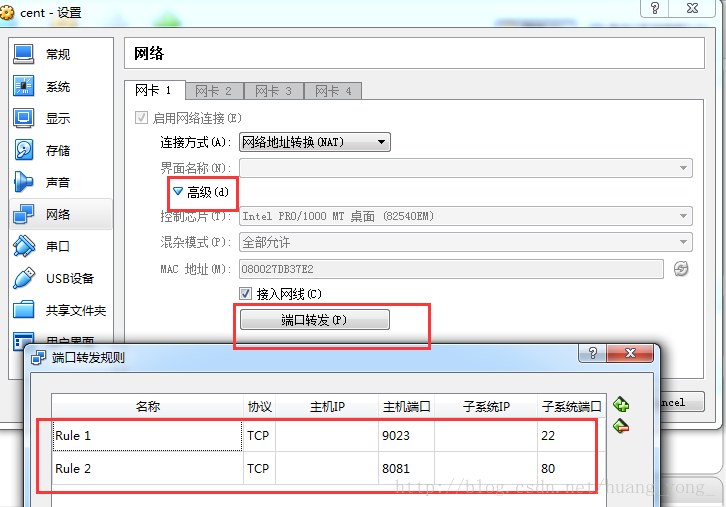
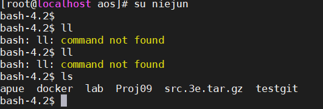

# 如何连接 VB里的centos

简单可行，只需配置virtualbox:

> 右键选择 ***VirtualBox6.1.4*** 里的Linux，我这里是以centos7为例子。 右键->设置->网络 连接方式选择 ：网络地址转换（NAT） 然后点高级->端口转发， 如图配置即可： 
>
> 
>
> 端口转发设置非常重要，shell连接本地ip上的9023端口，即可转发到虚拟机里的22端口。 主机端口和子系统端口可自己定义，根据实际需求设置。
>
> ***MobaXterm V20.1***  下ssh连接设置如下
>
> 
>
> 这样配置后，会通过ssh连接上本地虚拟机，并进入 配置的特定用户目录下

# linux时间及时区设置

```shell
##### 设置 date命令 显示的时区
date   # 查看当前时间  若显示 Mon Mar 23 14:01:05 EDT 2020 则代表时区是EDT美国东部时间(与北京时间的时差是 -12h)
sudo cp /usr/share/zoneinfo/Asia/Shanghai /etc/localtime   #将时区切换到中国 使用date将显示 类似 Tue Mar 24 02:04:49 CST 2020
# sudo cp /usr/share/zoneinfo/America/New_York /etc/localtime  # 切换回EDT时区

##### 永久修改系统时间
sudo hwclock --set --date "2020-3-25 11:54:30"    # 修改硬件时间(每次重启linux，系统时间会等于硬件时间，故直接修改硬件时间)
sudo hwclock --show  # 查看硬件时间
sudo hwclock --hctosys   # 同步系统时间和硬件时间，即 将当前系统时间置为 硬件时间

# 重启系统查看是否永久修改系统时间
reboot  # 重启系统
date    # 重启系统可以发现硬件时间和系统时间都修改成功
```

# Linux新建普通用户并赋予sudo权限

## 新建用户

```shell
su root    # 切换到root用户，新建用户需root权限，若当前登录时root账号，则无需此操作
adduser niejun  # 增加新用户 niejun
passwd niejun # 修改默认密码（若输入的密码很简单会提示，忽略即可）

```

## 为新用户授予 sudo权限

1. 查找授权管理文件sudoers

   ~~~shell
   whereis sudoers  # 可以看大这个文件位于 /etc/sudoers
   ~~~

2. 修改sudoers的写权限

   ~~~shell
   chmod -v u+w /etc/sudoers   # 为当前用户添加写权限，该文件默认是只读的
   ~~~

3. 修改sudoers内容

   ~~~shell
   vi /etc/sudoers   
   
   #按insert进入编辑模式，找到 root用户在的位置添加如下内容   
   niejun 	ALL=(ALL)			ALL
   # 效果如下所示
   ## Allow root to run any commands anywhere
   root 	ALL=(ALL)			ALL
   niejun 	ALL=(ALL)			ALL
   ## 最后按 esc 进入命令模式 键入命令 ZZ  保存退出
   ~~~

4. 收回sudoers的写权限

	~~~shell
	chmod -v u-w /etc/sudoers    #收回当前用户对 /etc/sudoers 文件的写权限
	~~~

## 用户切换	

```
su niejun  # 切换到用户 niejun
whoami     # 查看当前登录是哪个用户
groups niejun   # 查看 用户 niejun 所属的用户组

su  # 切换到root用户，或者键入 su root
```

## 可能出现的问题

> 使用 adduser niejun 添加用户后 /home/niejun 该文件夹会自动生成，
>
> 若 执行命令时 出现下列情况
>
> 
>
> 代表缺少 .bashrc 和 .bash_profile 文件，可从 /root 或 /home/xxuser 下复制这两个文件到 /home/niejun 下


# git操作命令

## .gitconfig

是git的全局配置文件，已配置好 git log的显示效果、显示中文文件名，linux系统将其复制到当前用户根目录 /home/xxx 即可。

## .git

存有暂存区和版本库、提交信息，若删除则本地仓库信息也随之删除，使用git status会提示 `fatal: Not a git repository (or any of the parent directories): .git`

在未push到远程仓库的情况下请勿随便删除，删除后可以通过

 `git init` 

`git rmote add origin xxx.git` 

来获取远程仓库的提交信息

## git常用命令

```c
   工作区：就是你在电脑上看到的目录，比如目录下testgit里的文件(.git隐藏目录版本库除外)。或者以后需要再新建的目录文件等等都属于工作区范畴。 
      版本库(Repository)：工作区有一个隐藏目录.git,这个不属于工作区，这是版本库。其中版本库里面存了很多东西，其中最重要的就是stage(暂存区)，还有Git为我们自动创建了第一个分支master,以及指向master的一个指针HEAD。 
我们前面说过使用Git提交文件到版本库有两步： 
  第一步：是使用 git add 把文件添加进去，实际上就是把文件添加到暂存区。 
  第二步：使用git commit提交更改，实际上就是把暂存区的所有内容提交到当前分支上。 
-----------------------------------------
设置：
git config -l  //查看当前配置
git config --global core.quotepath false // 设置显示中文文件名
git config --global user.name "stormzhang"
git config --global user.email "stormzhang.dev@gmail.com"  //此处邮箱应与github上的邮箱一致否则不会记录贡献
git log --graph --pretty=format:'%Cred%h%Creset -%C(yellow)%d%Creset	%s %Cgreen(%cr) %C(bold blue)<%an>%Creset' --abbrev-commit	 --date=relative
//git log的美化版
git config --global alias.lg "log --graph --pretty=format:'%Cred%h%Creset -%C(yellow)%d%Creset%s %Cgreen(%cr) %C(bold blue)<%an>%Creset' --abbrev-commit --date=relative"
//之后直接 git lg即能达到上述效果*/


如何将项目提交到git上
 1、在本地创建一个版本库（即文件夹），通过git init把它变成Git仓库；
2、把项目复制到这个文件夹里面，再通过git add .把项目添加到仓库；
3、再通过git commit -m "注释内容"把项目提交到仓库；
4、在Github上设置好SSH密钥后，新建一个远程仓库，通过
git remote add origin https://github.com/guyibang/TEST2.git 将本地仓库和远程仓库进行关联；
5、最后通过 git push -f origin master 把本地仓库的项目推送到远程仓库（也就是Github）上；
（参数f首次建议加上，以后可以不加。因为有的人在远程创建项目的时候会随着创建文件，没有f参数就不会覆盖远程已有的，导致push失败)


-----------------------------
git常用命令

git init //把当前的目录变成可以管理的git仓库，生成隐藏文件 .git。
git add XX //把xx文件添加到暂存区去。
git add .                     //git add将当前目录所有文件提交到暂存区：
git commit -m           "注释信息"//将暂存区的所有文件提交到仓库   多行注释需要使用  git commit
git status //查看仓库状态
git log //查看历史记录


git branch //查看本地所有的分支
git branch -r  # 查看所有远程分支
git branch name //基于当前分支新建name分支相当于复制了当前分支
git checkout master //切换回master分支
git checkout -b dev //创建dev分支 并切换到dev分支上
git branch -d dev //删除dev分支
git branch -dr origin/mat  # 删除origin对应远程仓库的mat分支

git merge dev //在当前的分支上合并dev分支
git clone https://github.com/zongyunqingfeng/testgit //从远程库中克隆

git remote //查看远程库的信息
git remote -v //查看远程库的详细信息
git remote add gitee git@gitee.com:komari/apue.git  //关联远程仓库，起名为gitee
git remote rm gitee  //取消关联名称为gitee的远程仓库


git push origin master //Git会把master分支推送到远程库对应的远程分支上
git push gitee master  //有多个远程仓库时，push需要制定仓库的名称，只有一个git push即可
git push origin :stars//删除远程仓库的 stars分支
git pull origin master //意思就是把远程最新的代码更新到本地。只有一个 gut pull即可。一般我们在push之前都会先pull这样不容易冲突

git rm a.txt //删除工作区里的文件a.txt，本地文件也将删除 (即删除 执行了git commit但还没git push的文件)
git rm -f a.txt //删除暂存区里的 a.txt并将本地文件 a.txt删除
 
git mv a.txt b.md  # 将暂存区里的 a.txt 改名为 b.md(仍在暂存区)，本地文件也被改成了 b.md
git rm --cached file  # 停止追踪file文件(相当于将该文件仍处于untracked files)

git tag v1.0 //为当前commit贴上版本号
git tag v1.0 commitid # 为 commitid对应的提交贴上版本号V1.0
git tag -d v1.0  # 删除本地tag
git push origin:refs/tags/v1.0  # 删除origin对应远程仓库的版本号v1.0
git reflog    //查看历史记录的版本号id

git diff readme.txt //只能比较当前文件和暂存区文件差异，什么是暂存区？就是你还没有执行git	add的文
git diff <$id1>	<$id2>			//比较两次提交之间的差异 
git diff <branch1>..<branch2>	//在两个分支之间比较	
git diff --staged			//比较暂存区和版本库差异

git reset -hard HEAD^ 或者 git reset -hard HEAD~                //回退到上一个版本 (如果想回退到100个版本，使用git reset -hard HEAD~100 )
git reset --hard 版本号  //根据版本号恢复 若之前使用了git tag v1.0 可直接 git reset --hard v1.0

git checkout -- readme.txt //把readme.txt文件在工作区做的修改全部撤销
	这里有2种情况，如下： 
	readme.txt自动修改后，还没有放到暂存区，使用 撤销修改就回到和版本库一模一样的状态。 
	另外一种是readme.txt已经放入暂存区了，接着又作了修改，撤销修改就回到添加暂存区后的状态。 
	对于第二种情况，我想我们继续做demo来看下，假如现在我对readme.txt添加一行 内容为6666666666666，
	我git add 增加到暂存区后，接着添加内容7777777，直接通过撤销命令把未添加到暂存区内容撤销掉。


git stash //把当前的工作隐藏起来 等以后恢复现场后继续工作
git stash list //查看所有被隐藏的文件列表
git stash apply //恢复被隐藏的文件，但是内容不删除
git stash drop //删除文件
git stash pop //恢复文件的同时 也删除文件

-------------------------
配置ssh
注册github账号，由于你的本地Git仓库和github仓库之间的传输是通过SSH加密的，所以需要一点设置： 
这个就是没有在你github上添加一个公钥。可以用 ssh -T git@github.com去测试一下
创建SSH Key。在用户主目录下，看看有没有.ssh目录，如果有，再看看这个目录下有没有id_rsa和id_rsa.pub这两个文件，如果有的话，直接跳过此如下命令；否则输入
ssh-keygen	-t	rsa	，什么意思呢？就是指定	rsa	算法生成密钥，接着连续三个回 车键（不需要输入密码），然后就会生成两个文件	id_rsa和	id_rsa.pub，而id_rsaid_rsa是私钥，不能泄露出去，id_rsa.pub是公钥，可以放心地告诉任何人。
---------------------------------------------------
在第一次进行推送时，需要注意的是，GitHub网站上的仓库并非是空的，我们在创建时创建了一个README文档，因此需要将两者进行合并才行。
git pull --rebase origin master
最后，在进行推送即可。

git push -u origin master
这个带有-u这个参数是指，将master分支的所有内容都提交，第一次关联之后后边你再提交就可以不用这个参数了，之后你的每一次修改，你就可以只将你修改push就好了。
git push origin master

常见问题:
remote: error: GH007: Your push would publish a private email address.
	在GitHub的你账号网页上右上角，个人的登录退出的位置，找到setting：
	setting->emails->Keep my email address private，把这一项去掉勾选即可。

git pull 失败 ,提示：fatal: refusing to merge unrelated histories
	使用这个强制的方法 git pull origin master --allow-unrelated-histories
---------------------------------------------------
```

## 本地仓库同时推送到多个远程仓库

#### 方法一

使用 `git remote add origin xxx.git`  将本地仓库与多个远程仓库关联

查看远程仓库情况

`[niejun@localhost lab]$ git remote -v`
`github  git@github.com:Komari-Koshigaya/apue-lab.git (fetch)`
`github  git@github.com:Komari-Koshigaya/apue-lab.git (push)`
`origin  git@gitee.com:komari/apue-lab.git (fetch)`
`origin  git@gitee.com:komari/apue-lab.git (push)`

然后再使用相应的命令 push 到对应的仓库就行了。*这种方法的缺点是每次要* push *多次。*

 `git  push origin master:master`

`git  push sudnyn master:master`

#### 方法二

1.只 `git remote add origin xx.git` 一次，

2.使用 `git remote set-url --add origin xx.git` 添加远程仓库

【或者修改本地仓库的  .git/config 文件，再 [remote "origin" 下增加 需要同时推送的 url]

```
[remote "origin"]
	url = git@gitee.com:komari/apue-lab.git
	fetch = +refs/heads/*:refs/remotes/origin/*
	url = git@github.com:Komari-Koshigaya/apue-lab.git //增加的push地址
```

】

查看远程仓库情况。可以看到 github 远程仓库有两个 push 地址。

`[niejun@localhost lab]$ git remote -v`
`origin  git@gitee.com:komari/apue-lab.git (fetch)`
`origin  git@gitee.com:komari/apue-lab.git (push)`
`origin  git@github.com:Komari-Koshigaya/apue-lab.git (push)`

*这种方法的好处是每次只需要*    `git push` *一次就行了。*

***推荐使用方法二***

## git导出代码

使用 git archive 可以将库中代码打包(一份干净的代码没有 .git 等)

> ~~~shell
> git archive --format tar.gz --output "./output.tar.gz" master
> # 将master分支打包为output.tar.gz
> # --format指明打包格式，若不指明此项，则根据--output中的文件名推断文件格式。所以你也可以将上述命令简化为:  
> git archive --output "./output.tar.gz" master
> 
> git archive -l  # 查看支持的文件格式列表(tar,tgz,tar.gz,zip)
> git archive --output "output.zip" 分支名  # 打包某个分支所有文件
> git archive --output "output.zip" 提交id  # 打包某次提交(通过git log找到相应的 提交id)
> 
> git archive --output "output.zip" master dir dir2  # 打包master分支下dir目录下的dir2目录
> ~~~
>
> #### ps： 打包建议在代码库的根目录下进行 

# docker使用方法

详见   [如何使用docker部署springboot项目](https://github.com/Komari-Koshigaya/university-services-with-miniprogram)

```shell
安装docker
yum -y install docker-io //权限不够则需加上 sudo
docker version //查看是否安装成功，出现版本号则成功
vi /etc/docker/daemon.json //设置docker镜像，若已开启服务修改后重启服务方生效

service docker start
service docker stop

sudo docker images
sudo docker pull mysql:5.8
sudo docker built -t miniserver:0.0.1 .
sudo doccker image rm miniserver:0.0.1

sudo docker run --rm -d -p 8080:8888 --name main --link mysql-docker:mysql-docker miniserver:0.0.1
sudo docker run -d -p 8080:8888 --name main miniserver:0.0.1 
sudo docker ps -a
sudo docker logs -f main
sudo docker stop main
sudo docker start main

# mysql 容器
sudo docker volume create mysql_data  #创建数据卷用来保存mysql的数据，可多个容器共享一个数据卷，当容器被删除时，数据卷不会被删除，mysql的数据依然存在
sudo docker run --name mysql-docker -v mysql_data:/var/lib/mysql -e MYSQL_ROOT_PASSWORD=123456 -p 3306:3306 -d mysql:5.7   # 执行此命令时必须先执行上一条命令


# 一般来说下面的命令用不上
sudo docker exec -it mysql-docker /bin/bash   #进入MySQL容器 /bin/bash
mysql -u root -p  # 进入容器里的mysql

# 设置外部网络访问mysql权限  外部访问权限不够才执行
ALTER user 'root'@'%' IDENTIFIED WITH mysql_native_password BY '123456';  --sql语句
FLUSH PRIVILEGES;    --sql语句
```

