# github相关操作

> 本文包括github的个性化配置

# 帅气的 github 主页

> 参考文章：[给自己弄一个酷酷的Github主页吧](https://blog.csdn.net/sinat_23133783/article/details/107643656)
>
> [2020年，一招教你打造个性化的Github主页！](https://blog.csdn.net/zwluoyuxi/article/details/107600491)

## 那些眼前一亮的主页

> 更多关于主页的模版项目：[Awesome-Profile-README-templates](https://github.com/kautukkundan/Awesome-Profile-README-templates) ，大家可以参考下别人的设计思路！

[AVS1508](https://github.com/avs1508)

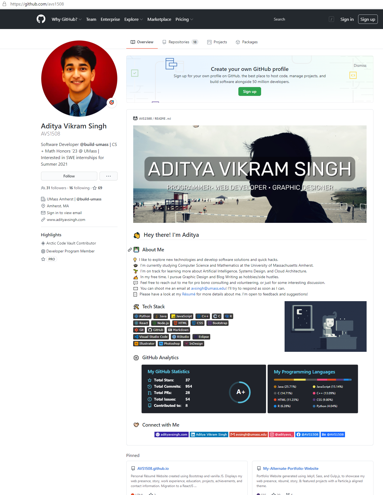


[amchuz](https://github.com/amchuz)


## 开启github主页

创建同名仓库, 同名是一个特殊的仓库，可以通过添加一个 `README.md`显示在你的Github个人主页。但必须保证仓库是public的并且有README文件。

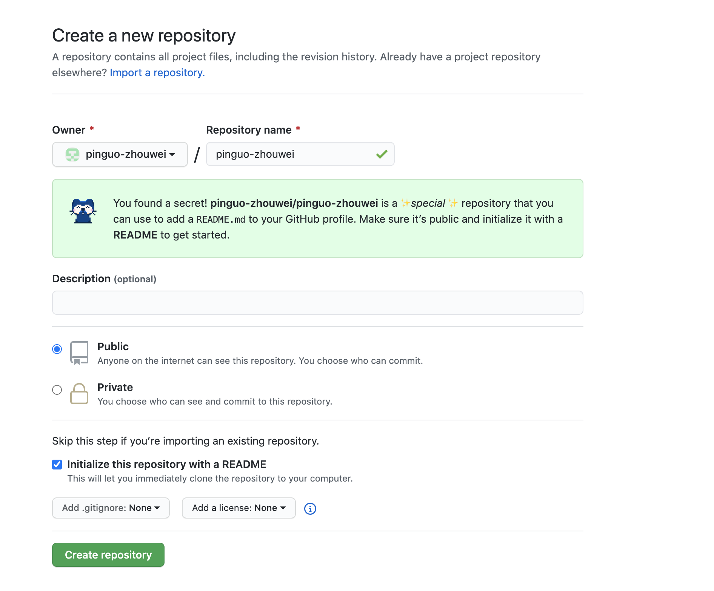

##  github-readme-stats

>  [github-readme-stats](https://github.com/anuraghazra/github-readme-stats)  包括展示github的stars、commits、prs、issues ，展示github中使用的语言统计和 仓库

### GitHub Stats Card 统计信息

> 展示github 统计信息

只需在 readme.md 插入 

~~~md
  
~~~

即可得到类似以下效果


还可以 选择显示的主题模式，在后面调用?theme=THEME_NAME 参数就可以了，内置了很多。如下：*dark, radical, merko, gruvbox, tokyonight, onedark, cobalt, synthwave, highcontrast, dracula*  更多主题详见 [all available themes](https://github.com/anuraghazra/github-readme-stats/blob/master/themes/README.md)

~~~md
  
~~~

即可得到类似以下效果

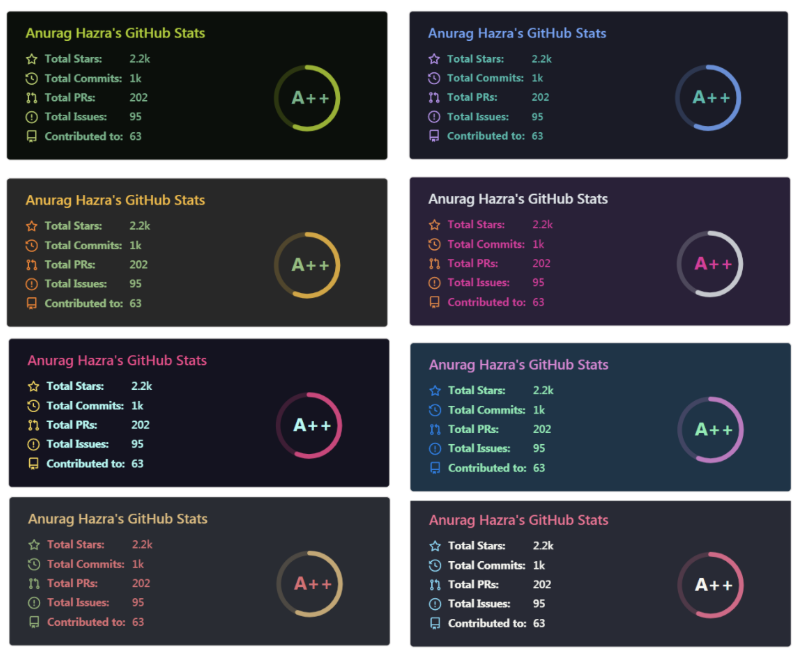

### github-extra-pins 贴出项目

```

```


更改主题  [all available themes](https://github.com/anuraghazra/github-readme-stats/blob/master/themes/README.md)

```

```


### Top Languages Card 语言使用比例

在README.md 插入以下超链接 即可展示个人仓库的常用语言

```

```

效果


#### Exclude individual repositories

You can use `?exclude_repo=repo1,repo2` parameter to exclude individual repositories.

```
[](https://github.com/anuraghazra/github-readme-stats)
```

#### Hide individual languages

You can use `?hide=language1,language2` parameter to hide individual languages.

```
[](https://github.com/anuraghazra/github-readme-stats)
```

#### Show more languages

You can use the `&langs_count=` option to increase or decrease the number of languages shown on the card. Valid values are integers between 1 and 10 (inclusive), and the default is 5.

```
[](https://github.com/anuraghazra/github-readme-stats)
```

#### Compact Language Card Layout

You can use the `&layout=compact` option to change the card design.

```
[](https://github.com/anuraghazra/github-readme-stats)
```

- default layout


- Compact layout


### Quick Tip (Align The Repo Cards)

> 若直接使用超链接无法对齐，可使用类似下面的html来实现

```
<a href="https://github.com/anuraghazra/github-readme-stats">
  
</a>
<a href="https://github.com/anuraghazra/convoychat">
  
</a>
```

效果如下

<a href="https://github.com/anuraghazra/github-readme-stats">
  
</a>

<a href="https://github.com/anuraghazra/convoychat">
  
</a>

## 统计代码时长

 这个功能非常有趣，这里我们要利用WakaTime对事情的统计功能，并绑定到Github来实现展示。官网：[WakaTime](https://wakatime.com/)

下面详细讲一下如何部署到Github：

### 1.登录WakaTime官网，注册 一个WakaTime 账号

这里我是直接绑定的Github账号登录，非常方便，推荐！

### 2.在自己常用的 IDE 上下载 WakaTime 插件，配置上自己的 API Key

当注册好账号后，你会得到属于自己专属的API Key。然后在需要监控工作的IDE里安装WakaTime的插件，并配上自己的Key。官方上有非常详细的配置步骤，如下以WebStorm为例：

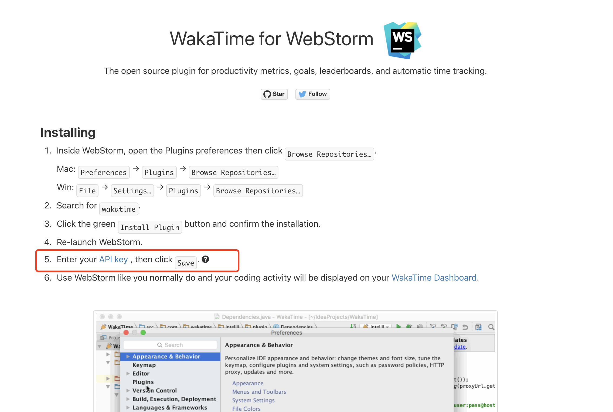

到此为止，其实本地的开发环境就已经被WakaTime所监控啦，数据会被传输到WakaTime然后在dashboard中展示。

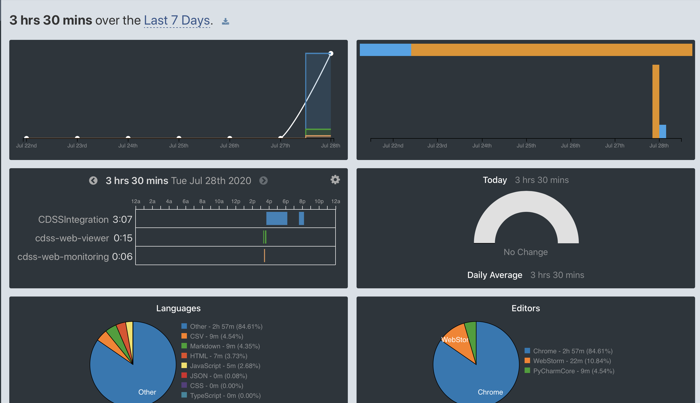

除WebStorm外，WakaTime还支持很多其他的开发环境，如下：

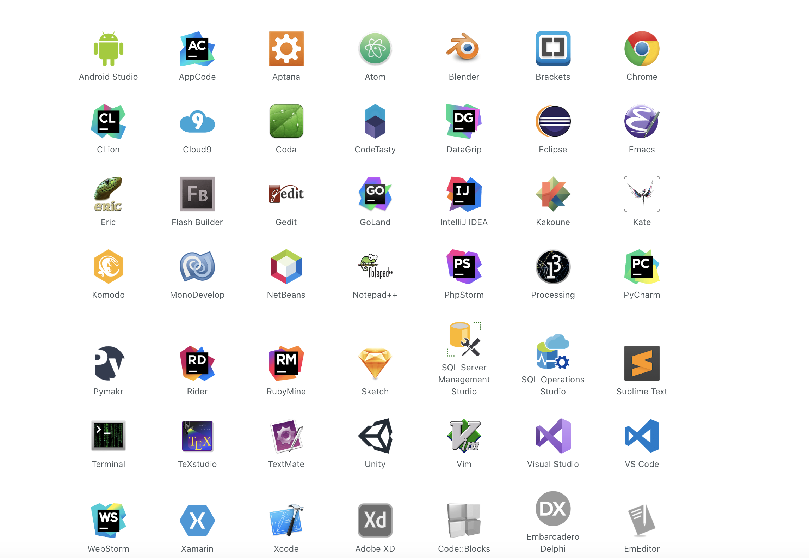

### 3.将自己的 API Key 存到自己 Github 仓库的 secrets中

从项目里点击Setting -> Secrets -> New secret 创建一个。其中name需要填写**WAKATIME_API_KEY**，value就把WakaTime官网生成的API Key粘贴进去就行。


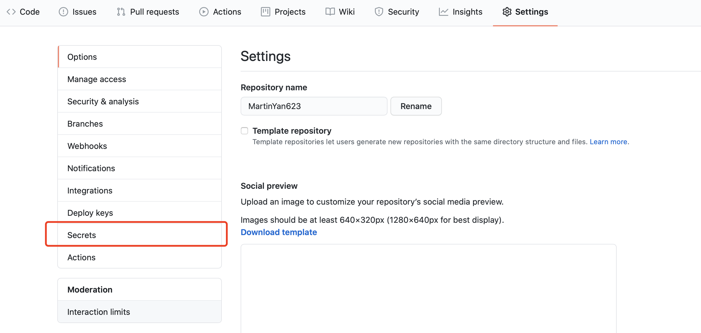

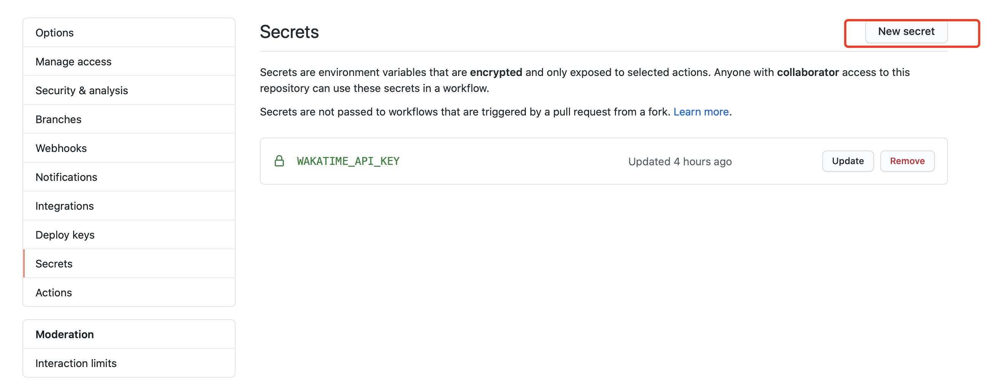

 

### 4.配置 GitHub 仓库的 Actions

我们还需要在项目里配置Actions。点击 Actions -> New workflow 

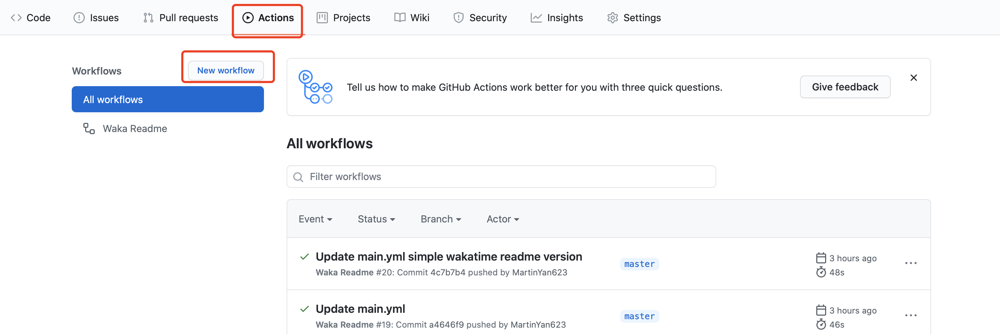

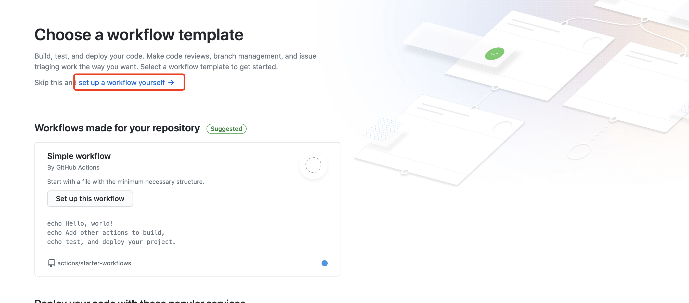

把默认的内容全部删除，把下面的内容粘贴上：

```yml
name: Waka Readme
 
on:
  push:
    branches:
      - master
  workflow_dispatch:
  schedule:
    # Runs at 12am UTC
    - cron: '0 0 * * *'
 
jobs:
  update-readme:
    name: Update this repo's README 
    runs-on: ubuntu-latest
    steps:
      - uses: MartinYan623/waka-readme@master
        with:

```

这里需要改的是uses中的地方换成你自己的路径。

如果出现以下这个报错信息，则是因为uses中的路径错误。如下所示：


**注意：这里需要一个waka-readme的项目，请将https://github.com/athul/waka-readme中的项目fork到自己仓库里就行！ 之前没发现需要fork利用别人写好的东西，结果写的workflow action跑不起来，这里替你们踩坑了！**

### 5.点击 Waka Readme ，再点击run

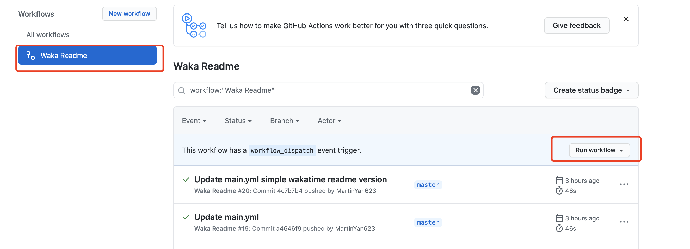

 当你看到正常跑起来之后，就离胜利不远啦！

### 6. 在README文件中添加以下这段文字：

~~~
 <!--START_SECTION:waka-->
 <!--END_SECTION:waka-->
~~~

添加修改后，再次提交commit。然后，返回到主页，会看到以下这样，说明WakaTime其实已经关联上你的Github啦！需要等待一段时间（一天），就会同步到Github啦！


## 关闭个人首页

有一天自闭了，不想在首页向其他人介绍自己，有以下几种方式

- 删除README.me文件。
- 仓库设置为私有。
- 仓库名称不再与Github用户名匹配。

# 制作徽章Badge

## 效果图

github开源仓库常见以下效果图


对应标签

```markdown
<p align="center">
 
 <h2 align="center">GitHub Readme Stats</h2>
 <p align="center">Get dynamically generated GitHub stats on your readmes!</p>
</p>
  <p align="center">
    <a href="https://github.com/anuraghazra/github-readme-stats/actions">
      
    </a>
    <a href="https://codecov.io/gh/anuraghazra/github-readme-stats">
      
    </a>
    <a href="https://github.com/anuraghazra/github-readme-stats/issues">
      
    </a>
    <a href="https://github.com/anuraghazra/github-readme-stats/pulls">
      
    </a>
    <br />
    <br />
    <a href="https://a.paddle.com/v2/click/16413/119403?link=1227">
      
    </a>
    <a href="https://a.paddle.com/v2/click/16413/119403?link=2345">
      
    </a>
  </p>

  <p align="center">
    <a href="#demo">View Demo</a>
    ·
    <a href="https://github.com/anuraghazra/github-readme-stats/issues/new/choose">Report Bug</a>
    ·
    <a href="https://github.com/anuraghazra/github-readme-stats/issues/new/choose">Request Feature</a>
  </p>
  <p align="center">
    <a href="/docs/readme_fr.md">Français </a>
    ·
    <a href="/docs/readme_cn.md">简体中文</a>
    ·
    <a href="/docs/readme_es.md">Español</a>
    ·
    <a href="/docs/readme_de.md">Deutsch</a>
    ·
    <a href="/docs/readme_ja.md">日本語</a>
    ·
    <a href="/docs/readme_pt-BR.md">Português Brasileiro</a>
    ·
    <a href="/docs/readme_it.md">Italiano</a>
    ·
    <a href="/docs/readme_kr.md">한국어</a>
    .
    <a href="/docs/readme_nl.md">Nederlands</a>
  </p>
</p>
<p align="center">Loved the project? Please consider <a href="https://www.paypal.me/anuraghazra">donating</a> to help it improve!
```


<p align="center">
 
 <h2 align="center">GitHub Readme Stats</h2>
 <p align="center">Get dynamically generated GitHub stats on your readmes!</p>
</p>
  <p align="center">
    <a href="https://github.com/anuraghazra/github-readme-stats/actions">
      
    </a>
    <a href="https://codecov.io/gh/anuraghazra/github-readme-stats">
      
    </a>
    <a href="https://github.com/anuraghazra/github-readme-stats/issues">
      
    </a>
    <a href="https://github.com/anuraghazra/github-readme-stats/pulls">
      
    </a>
    <br />
    <br />
    <a href="https://a.paddle.com/v2/click/16413/119403?link=1227">
      
    </a>
    <a href="https://a.paddle.com/v2/click/16413/119403?link=2345">
      
    </a>
  </p>

  <p align="center">
    <a href="#demo">View Demo</a>
    ·
    <a href="https://github.com/anuraghazra/github-readme-stats/issues/new/choose">Report Bug</a>
    ·
    <a href="https://github.com/anuraghazra/github-readme-stats/issues/new/choose">Request Feature</a>
  </p>
  <p align="center">
    <a href="/docs/readme_fr.md">Français </a>
    ·
    <a href="/docs/readme_cn.md">简体中文</a>
    ·
    <a href="/docs/readme_es.md">Español</a>
    ·
    <a href="/docs/readme_de.md">Deutsch</a>
    ·
    <a href="/docs/readme_ja.md">日本語</a>
    ·
    <a href="/docs/readme_pt-BR.md">Português Brasileiro</a>
    ·
    <a href="/docs/readme_it.md">Italiano</a>
    ·
    <a href="/docs/readme_kr.md">한국어</a>
    .
    <a href="/docs/readme_nl.md">Nederlands</a>
  </p>
<p align="center">Loved the project? Please consider <a href="https://www.paypal.me/anuraghazra">donating</a> to help it improve!


## 如何制作

[shields](https://shields.io/) 网站提供了很多徽章类型，要包括了：构建、代码覆盖率、分析
闲谈，聊天、依赖关系、大小、下载等等。

当在网站上设计好徽章之后，只需要将生成的URL放到README中，就可以在主页上看到啦，非常简单。

### 基本信息

~~~
https://img.shields.io/badge/<LABEL>-<MESSAGE>-<COLOR>
如 https://img.shields.io/badge/bootstrap-4.9-green 效果如下
~~~


## 加上样式

在基本信息后加上下列字符串即可 实现对应效果

| `?style=plastic&logo=appveyor`       |  |
| ------------------------------------ | ------------------------------------------------------------ |
| `?style=flat&logo=appveyor`          |  |
| `?style=flat-square&logo=appveyor`   |  |
| `?style=for-the-badge&logo=appveyor` |  |
| `?style=social&logo=appveyor`        |                         |

所有logo 可以在 [simpleicons](https://simpleicons.org/) 找到对应的名字替换即可

如 `https://img.shields.io/badge/bootstrap-4.9-green?logo=twitter`

